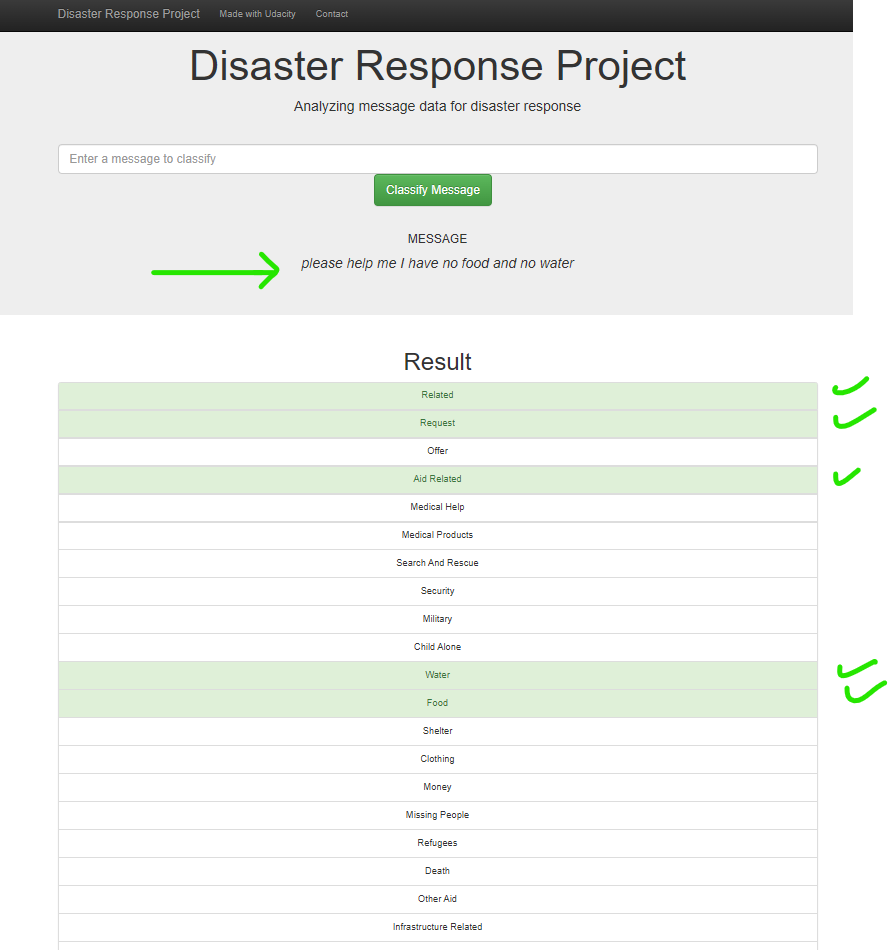

# Disaster Response Pipeline Project

1. Project overview

This is the second project of [Udacity's Data Scientist Nanodegree](https://www.udacity.com/course/data-scientist-nanodegree--nd025).
The project's objective is design a ML application supporting Disaster Emergency Response API. Tha app is composed of the following:
- front-end API where disaster messages can be submitted for classification inference
- back-end leveraging a trained classifier model. The model tags the message along 36 different labels such as 'Food', 'Water', 'Medical support', 'Request (for)'
The app therefore allows to redirect messages to the appropriate first-line emergency response bodies.

2. Dataset used for model training

The datasets used for training the model has been provided by [Appen](https://www.figure-eight.com/) (formally Figure 8). The datasets are composed of :
- a message dataset collected from various sources during past disaster around the globe. It has a total of 26,248 text messages (original language and english translation)
- a categories dataset tagging each message along 36 labels (classification classes).

3. Architecture of the project
    - ETL pipeline: Loads the datasets, merges and clean data, stores in SQLite database
    - ML pipeline: Loads data from SQLite database. Segregate into train and test sets, Builds a text processing and machine learning pipeline, trains and fine-tunes a model using GridSearchCV, evaluates model performance and export final model as pickle file
    - Flask Web App: The flask app provides a classification inference API using the trained model

'''
│   .gitignore
│   categories.csv
│   commands.docx
│   ETL Pipeline Preparation.ipynb
│   LICENSE
│   messages.csv
│   ML Pipeline Preparation.ipynb
│   README.md
│   requirements.txt
│   Twitter-sentiment-self-drive-DFE.csv
│
├───.ipynb_checkpoints
│       ML Pipeline Preparation-checkpoint.ipynb
│
├───app
│   │   run.py
│   │
│   └───templates
│           go.html
│           master.html
│
├───assets
│       class_imbalance.png
│       fine-tuning.png
│       front_end.png
│       message_inference.png
│       wordcloud.png
│
├───data
│       DisasterResponse.db
│       disaster_categories.csv
│       disaster_messages.csv
│       process_data.py
│
└───models
        classifier.pk
        model_performance.png
        train_classifier.py
'''

4. Class imbalance issue

The dataset has a large class imbalance with the 4 top labels representing over 95% of the messages. This is detrimental during training step since a model will see a majority of these top class samples and much less from those under-represented. The error rate on these under-represented classes is expected to be high. Trained model performance is therefore measured on each of the 36 classes.

To minimize this issue, data augmentation was performed on the labels with less than 1,000 available samples. Data augmentation was performed using NLPAug package which allows to produce additional text samples by replacing certain words with synonyms. An illustration is shown below:

Original:
- `UN reports Leogane 80-90 destroyed. Only Hospital St. Croix functioning. Needs supplies desperately.`

Augmented Text:
- `united nations reports Leogane fourscore - 90 destroyed. But Infirmary St. Croix functioning. Needs supplies desperately.`
- `united nations account Leogane eighty - ninety destroyed. Solely Infirmary St. Croix functioning. Needs supplies desperately.`
- `UN reports Leogane eighty - ninety destroyed. Only Infirmary St. Croix operate. Needs provision desperately.`

An alternative to data augmentation would be to use a reduce dataset with equal proportion of labels. However since some labels have so few samples, this would imply reducing the dataset a lot resulting in the loss of massive training information.

5. Training step:

During preparation, XGBoost demonstrated higher performance compared to ramdomforest. GridSearchCV was performed but with minimal improvement over standard parameters. Several feature engineering approaches were tested with minimal performance improvements:
- length of the message
- use of `genre` categorical variable. each message has this information. There are 3 sources: 'news', 'social' or 'direct'. I would have expected this could add classification information but the data analysis performed during ETL did not show any particular correlation with specific labels.
- messages starting with a verb

The data augmentation improved performance significantly on the under-represented classes.

The training pipeline was therefore composed of:
- data augmentation on less represented classes
- tokenization and vectorization using tfIdf. paramters were set at min 3 occurences and lax 10,000 features to prevent memory issues and reduce training time without noticeable performance deterioration
- GridSearch hyperparameter tuning (n_estimators, max_depth)

Below is the overview of model performance in the various testing conditions. Saved model is XGBoost with data augmentation (last column to the right).

6. Front-end API

The front-end displays some insights extratced from the dataset.
    - wordcloud using most frequent words in the messages dataset. I used my tokenization step from production.
    - class imbalance overview
    - message inference (illustration below)

7. Environment set-up

The project runs in a virtual environment using python 3.8 and the python packages provided in the requirements.txt file

8. Instructions
    1. Run the following commands in the project's root directory to set up your database and model.

        - To run ETL pipeline that cleans data and stores in database
            `python data/process_data.py data/disaster_messages.csv data/disaster_categories.csv data/DisasterResponse.db`
        - To run ML pipeline that trains classifier and saves
            `python models/train_classifier.py data/DisasterResponse.db models/classifier.pk`

    2. Go to `app` directory: `cd app`

    3. Run your web app: `python run.py` 

    4. Click to open the browser at the API specified address

